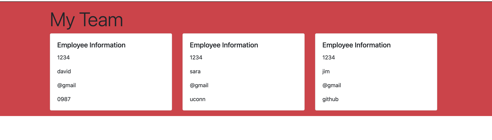

 # Project Name
  Team Profile Generator
  
  ## Table of Contents
  1. [Description](#description)
  2. [Video](#video)
  3. [Email](#email)
  4. [Github](#github)
  4. [Collaborators](#collaborators)
  
  ## Description
  Command-line application that takes in information about employees on a software engineering team, then generates an HTML webpage that displays summaries for each person.

  ## Video
  https://drive.google.com/file/d/1n9hd4p28oGCbX4nP-zPl0OTI-OmXkN5-/view
  

  ## Email
  david.m.parker92@gmail.com

  ## Github
  https://github.com/DavidParker42?tab=repositories

  ## Collaborators
  https://github.com/Afrema90